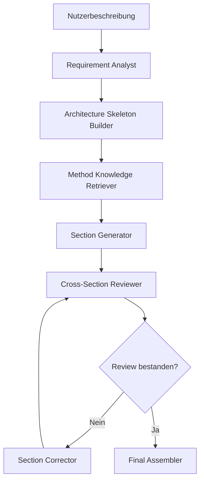
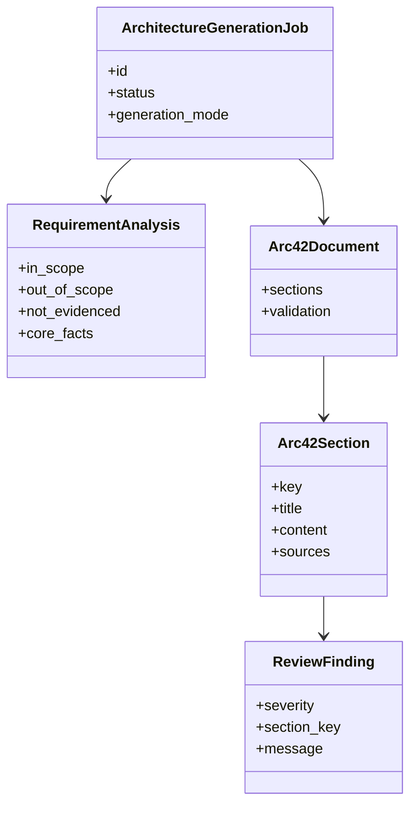

# TODO: Kapitelweise Architektur-Erzeugung

## Ziel

Die Software Factory soll nicht mehr ein komplettes Architecture Sheet in einem
grossen Synthese-Schritt erzeugen. Stattdessen soll der Prozess ein echtes
arc42-Dokument kapitelweise aufbauen. Jedes Kapitel bekommt nur die fachlichen
Fakten, bereits erzeugten Abhaengigkeiten und das passende Methodenwissen, das
fuer dieses Kapitel relevant ist.

Damit wird der Prozess produktionsnaeher:

- bessere Tiefe pro arc42-Kapitel
- gezielteres Methodenwissen statt grosser Prompt-Mischung
- weniger Halluzinationen
- einfachere Korrekturlaufe pro Kapitel
- bessere Laufzeitbeobachtung pro Schritt
- sauberere Uebergabe an spaetere Workorder-, Implementierungs- und Testagenten

## Grundprinzip

Fachliche Anforderungen kommen ausschliesslich aus der Nutzerbeschreibung und
der daraus erzeugten Requirement-Analyse. Methodenwissen beschreibt nur, wie
diese Informationen strukturiert, bewertet und dokumentiert werden.

```text
Fachlicher Scope
-> Nutzerbeschreibung
-> Requirement Analyst
-> in_scope, out_of_scope, not_evidenced, core_facts

Methodenwissen
-> arc42-Referenz
-> Django-Guidelines
-> Architekturprinzipien
-> Review-Regeln
-> Kapitel-spezifische Generator-Hinweise
```

Der Syntheseprozess darf `out_of_scope` und `not_evidenced` nicht als aktuelle
Architektur verwenden. Diese Informationen duerfen nur als Abgrenzung,
Nicht-Ziel, Risiko oder offene Klaerung auftauchen.

## Zielpipeline

1. **Requirement Analyst**
   - extrahiert fachliche Fakten aus der Beschreibung
   - erzeugt `in_scope`, `out_of_scope`, `not_evidenced`, `core_facts`
   - markiert Annahmen, Risiken und offene Fragen

2. **Architecture Skeleton Builder**
   - erzeugt ein leeres arc42-Dokument mit allen 12 Kapiteln
   - ordnet Requirement-Fakten den passenden Kapiteln zu
   - definiert Abhaengigkeiten zwischen Kapiteln

3. **Method Knowledge Retriever**
   - sucht pro Kapitel gezielt relevante Methodenquellen
   - liefert nur die benoetigten Ausschnitte an den jeweiligen Section Generator
   - dokumentiert verwendete Quellen pro Kapitel

4. **Section Generators**
   - erzeugen die arc42-Kapitel einzeln
   - verwenden nur erlaubte fachliche Fakten und kapitelbezogenes Methodenwissen
   - geben strukturierte JSON-Abschnitte nach Schema zurueck

5. **Cross-Section Reviewer**
   - prueft Konsistenz zwischen Kapiteln
   - prueft Scope-Verletzungen gegen `in_scope`, `out_of_scope`, `not_evidenced`
   - prueft fehlende Kapitelinhalte, Widersprueche und Sprachmischung

6. **Section Corrector**
   - korrigiert gezielt einzelne fehlerhafte Kapitel
   - entfernt nicht belegte oder ausgeschlossene Inhalte
   - startet nicht das komplette Dokument neu, wenn nur ein Kapitel betroffen ist

7. **Final Assembler**
   - setzt alle Kapitel zu einem finalen Architecture Sheet zusammen
   - erzeugt JSON- und Markdown-Artefakte
   - speichert Quellen, Reviews, Korrekturen und Laufzeiten

## Kapitel und benoetigtes Wissen

| arc42 Kapitel | Benoetigte fachliche Inputs | Benoetigtes Methodenwissen |
| --- | --- | --- |
| 1. Einfuehrung & Ziele | Business Goal, Stakeholder, Qualitaetsziele | arc42 Kapitel 1, Ziel-/Stakeholder-Regeln |
| 2. Randbedingungen | Constraints, Annahmen, offene Fragen | Constraint-Katalog, Abgrenzungsregeln |
| 3. Kontext & Abgrenzung | Nutzer, Schnittstellen, `in_scope`, `out_of_scope`, `not_evidenced` | Kontextsicht, Scope-Boundary-Review |
| 4. Loesungsstrategie | Kernfakten, Treiber, wichtigste Entscheidungen | Architekturprinzipien, Django-Leitlinien |
| 5. Bausteinsicht | Fachobjekte, Workflows, Django-Zielarchitektur | Django App-Schnitt, Modulgrenzen, Services |
| 6. Laufzeitsicht | Workflows, Bausteine, wichtige Fehlerfaelle | Runtime-View-Regeln, Szenario-Auswahl |
| 7. Verteilungssicht | Runtime, Container, Datenbank, Worker | Deployment-Guidance, Docker/Postgres/Redis |
| 8. Querschnittliche Konzepte | Security, Validation, Logging, Testing | Querschnittskonzepte, Architekturprinzipien |
| 9. Architekturentscheidungen | Treiber, Alternativen, Begruendungen | ADR-Regeln, Entscheidungsqualitaet |
| 10. Qualitaetsanforderungen | Qualitaetsziele, Akzeptanzkriterien | Qualitaetsszenarien, Teststrategie |
| 11. Risiken & technische Schulden | Risiken, offene Fragen, Annahmen | Risiko-Review, technische Schulden |
| 12. Glossar | Fachbegriffe, Rollen, Kernobjekte | Glossar-Regeln, gemeinsame Sprache |

## Diagramme und Grafiken

Die naechste Ausbaustufe soll Diagramme als erstklassige Artefakte behandeln.
Sie sollen aus dem Architecture Sheet abgeleitet, versioniert und im Frontend
anzeigbar sein.

### BPMN

Ziel: Fachliche Kernprozesse sichtbar machen.

Erste Kandidaten:

- Architecture-Sheet-Generierung als BPMN-Prozess
- spaeter: fachliche Workflows der beschriebenen Zielanwendung

Offene Entscheidungen:

- Format: BPMN 2.0 XML oder Mermaid-kompatible Prozessdarstellung
- Renderer im Frontend
- Validierung der Prozessstruktur

### Flussdiagramme

Ziel: Agenten- und Korrekturlaufe erklaeren.

Erste Kandidaten:

- Requirement Analyse bis Final Assembler
- Review-Fehler fuehrt zu Section Corrector
- Kapitelgenerierung mit gezieltem Methoden-Retrieval

Moegliches Format:



### Klassendiagramm

Ziel: Struktur der Software Factory selbst und spaeter der Zielanwendung
sichtbar machen.

Erste Kandidaten fuer die Software Factory:

- `ArchitectureGenerationJob`
- `RequirementAnalysis`
- `Arc42Document`
- `Arc42Section`
- `SectionGenerationResult`
- `ReviewFinding`
- `ArchitectureSheetArtifact`

Moegliches Format:



## Implementierungs-TODOs

1. **Datenmodell fuer kapitelweise Ergebnisse definieren**
   - `Arc42Section`
   - `SectionGenerationResult`
   - `SectionReviewResult`
   - Quellen und Laufzeiten pro Kapitel

2. **Methoden-Retrieval pro Kapitel bauen**
   - Suchquery aus Kapitel-Key und aktuellem Arbeitsschritt ableiten
   - relevante Dateien aus `data/software-factory/architecture-method/` finden
   - verwendete Methodenquellen im Job speichern

3. **Architecture Skeleton Builder implementieren**
   - Requirement-Fakten auf arc42-Kapitel mappen
   - Kapitel-Abhaengigkeiten definieren
   - leeres Dokument mit Pflichtstruktur erzeugen

4. **Section Generatoren einfuehren**
   - ein generischer Generator mit Kapitel-Konfiguration
   - spaeter optionale Spezialgeneratoren fuer Kapitel 5, 6, 10
   - JSON-Contract pro Kapitel validieren

5. **Cross-Section Review einbauen**
   - Scope-Verletzungen ueber alle Kapitel pruefen
   - Widersprueche zwischen Kontext, Bausteinsicht, Laufzeitsicht und Deployment erkennen
   - Sprachkonsistenz Deutsch pruefen

6. **Gezielte Korrekturlaufe pro Kapitel**
   - maximal ein bis zwei Korrekturen pro fehlerhaftem Kapitel
   - Review-Findings an Section Corrector geben
   - nur betroffene Kapitel neu erzeugen

7. **Diagramm-Artefakte erzeugen**
   - Mermaid-Flussdiagramm fuer Software-Factory-Prozess
   - BPMN-Entwurf fuer zentrale Workflows
   - Klassendiagramm fuer Architekturmodell

8. **Frontend erweitern**
   - Kapitelstatus anzeigen
   - Quellen pro Kapitel anzeigen
   - Diagramme rendern
   - Korrekturlaufe und Review-Findings pro Kapitel sichtbar machen

9. **Observability erweitern**
   - Laufzeit pro Kapitel
   - LLM-Call-Dauer pro Kapitel
   - Anzahl Korrekturlaufe pro Kapitel
   - Fehlerursachen und Review-Findings als strukturierte Metriken

10. **Tests ergaenzen**
    - Kapitelgenerator nutzt nur erlaubten Scope
    - Methoden-Retrieval liefert kapitelbezogenes Wissen
    - Cross-Section Review findet Widersprueche
    - Diagramm-Artefakte werden erzeugt und gespeichert

## Akzeptanzkriterien

Die Ausbaustufe gilt als fertig, wenn:

- jedes arc42-Kapitel als eigener Job-Schritt sichtbar ist,
- jedes Kapitel seine verwendeten Methodenquellen ausweist,
- Scope-fremde Inhalte pro Kapitel erkannt und korrigiert werden,
- das finale JSON weiterhin den `architecture_sheet.schema.json` Contract
  erfuellt,
- Markdown-Artefakte alle Kapitel in Dokumentform ausgeben,
- mindestens ein Flussdiagramm, ein BPMN-Entwurf und ein Klassendiagramm als
  Artefakt erzeugt oder versioniert werden,
- die komplette Test-Suite gruen ist.
